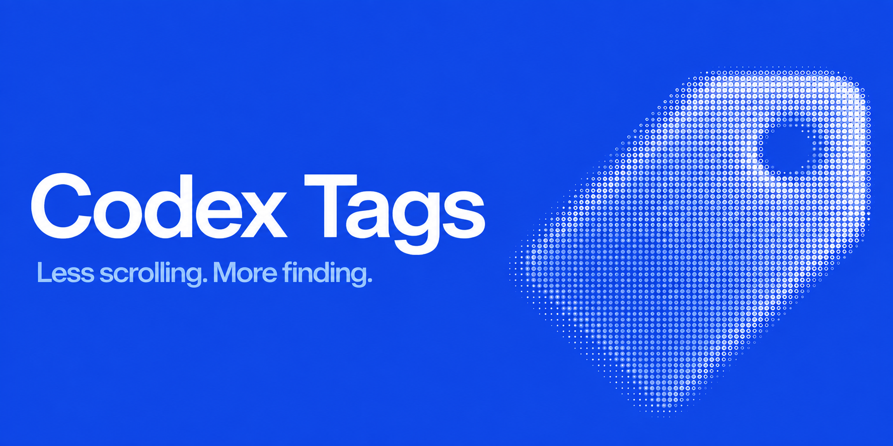

<p align="center"></p>
<p align="center"><b>English</b> · <a href="README.zh-CN.md">简体中文</a></p>
<p align="center"><a href="#get-started">Get started</a> · <a href="#commands">Commands</a> · <a href="docs/development.md">Development</a> · <a href="docs/architecture.md">Architecture</a></p>

An independent, local-first enhancement for Codex: organize sessions with tags, search conversation text, and give the agent your classification rules.

**macOS · Node.js 22+ · English / 简体中文**

> **0.6.1** — Fix Tags popup backgrounds in light mode. Update with `npx @c0sc0s/codex-tags@latest update`.

> **Early release** — Automated checks pass. Clean-account cold-start and manually trusted first-turn naming still need full end-to-end acceptance; see [verification coverage](docs/compatibility.md).

## Features

- **Native-aligned sidebar:** tag filtering, quiet title labels, and a Tags dashboard.
- **Local search:** titles and indexed user/assistant text, with highlighted matches.
- **Your vocabulary:** Feature, Bug, Design, Research defaults; custom colors and optional classification descriptions.
- **Agent-assisted naming:** `[Tag]Title`, without dates. First prompts receive current classification guidance.
- **Three plugin skills:** `doctor` checks health; `initial` classifies existing active sessions; `rename` names the current session.
- **English and Chinese UI:** follows Codex's language without translating user-defined tags.

## Get started

### 1. Install the CLI and plugin

Finish active tasks and quit Codex if it is open without Tags, then run:

```bash
npx @c0sc0s/codex-tags@latest
```

### 2. Authorize the hooks

Open **Codex → Plugins → Codex Tags** and review/trust **SessionStart**, **UserPromptSubmit**, and **SessionEnd**.

**Next time:** open `~/Applications/Codex Tags.app` and pin it to the Dock. This is the Codex Plugin Loader entry: it starts the official app and loads configured modules, including Tags. The existing app path is retained for Dock compatibility. No automatic restart or launch supervisor. Naming is agent-assisted, not a guaranteed title rewrite.

<details>
<summary>Develop or install from source</summary>

```bash
git clone https://github.com/c0sc0s/codex-tags.git
cd codex-tags
npm ci
npm run verify
node bin/codex-tags.mjs install
```

Then authorize the same three hooks above.

</details>

## Commands

Run `npx @c0sc0s/codex-tags@latest <command>`. From source: `node bin/codex-tags.mjs <command>`.

| Command | Effect |
| --- | --- |
| `install`, `on`, `enable` | Install this package version and activate all components |
| `off`, `restore`, `disable` | Stop injection and remove the naming plugin; keep data |
| `status` / `doctor` | Inspect state / diagnose readiness without changes |
| `update` | Install the invoked version; use `@latest` to fetch the newest |
| `uninstall` | Remove owned components and index; keep tag settings |
| `uninstall --purge` | Also remove settings and owned caches |

Operational commands support `--json`. Hook trust remains a manual Codex security decision.

## Privacy and compatibility

The CLI installs local code and registers the plugin through Codex's plugin commands. It does **not** patch the signed app, edit transcripts, or change authentication data. A local SQLite index supplies bounded matching snippets to the UI.

Injection relies on a loopback debugging endpoint and private Codex DOM/database interfaces—not an official sidebar extension API. Future Codex updates can require adapter changes. Debugging access is powerful; use only on a trusted machine. See [verified coverage and limitations](docs/compatibility.md).

## Development

```bash
npm run dev:apply   # build → refresh installed files → hot-apply
npm run verify     # build, syntax, types, regression tests
npm run test:package
```

The fast loop requires an already activated, debug-enabled app. No HMR server is used.

- [Development and debugging](docs/development.md)
- [Installation and release](docs/distribution.md)
- [Architecture](docs/architecture.md) · [Data and naming protocol](docs/protocol.md)
- [Roadmap](docs/roadmap.md) · [Changelog](CHANGELOG.md)

Not affiliated with or endorsed by OpenAI. No open-source license is currently granted (`UNLICENSED`).

See [Codex Plugin Loader](docs/plugin-loader.md) for the independent package and module SDK: Loader manages CDP, isolated service processes and RPC/events; modules implement business behavior.
