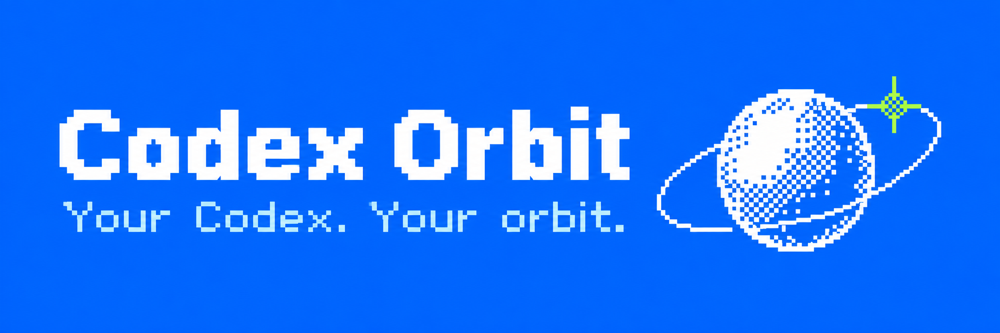

<p align="center"></p>

# OrbitAI

A local extension platform for the official Codex desktop app.

[简体中文](README.zh-CN.md) · [Installation](docs/distribution.md) · [Architecture](docs/architecture.md) · [Development](docs/development.md)

Install **Orbit**, then choose optional capabilities. Orbit owns the launcher, runtime, plugin registration and lifecycle. **Orbit Tags** provides session tags, local search and naming guidance.

| Package | Responsibility |
| --- | --- |
| [Orbit](packages/orbit/README.md) · `@c0sc0s/orbit` | Installation, launcher, plugins, CDP, service processes and RPC |
| [Orbit Tags](packages/orbit-tags/README.md) · `@c0sc0s/orbit-tags` | Tags, search, sidebar UI and naming hooks |
| `website` | Product website |

## Install from this checkout

Requires macOS, Node.js 22.13+ and the official Codex desktop app. Orbit 0.5.0 and Tags 0.9.0 are unpublished npm candidates; use local packages.

```sh
npm ci
npm run verify
npm pack -w @c0sc0s/orbit
npm install -g ./c0sc0s-orbit-0.5.0.tgz
orbit install
orbit plugin add ./packages/orbit-tags
orbit start
orbit doctor
```

Tags is optional: omit `plugin add` for a zero-plugin installation. If Codex is running without debugging, quit it manually before starting Orbit. Use `~/Applications/Orbit.app` for subsequent launches. Review naming hooks in Codex Plugins; installation does not grant hook trust.

## Development

Strict TypeScript compiles to ESM and declarations. The UI uses Preact, Motion and esbuild; search uses local SQLite FTS5. Business plugins use Orbit's public SDK. Orbit has no Tags or SQLite dependency.

```sh
npm run verify
npm run test:package
npm run dev:apply
npm run qa:app
```

The development apply loop installs workspace packages and attaches to an already debug-enabled app. See [source layout](docs/source-layout.md) and [contributing](CONTRIBUTING.md).

## Privacy and limits

Orbit does not modify the signed application, sessions or authentication. Renderer assets and search content stay local. Plugins are trusted code: services have Node privileges, and renderers share Codex's DOM and main thread.

[Compatibility](docs/compatibility.md) records verification coverage and manual release gates. No open-source license is granted.
